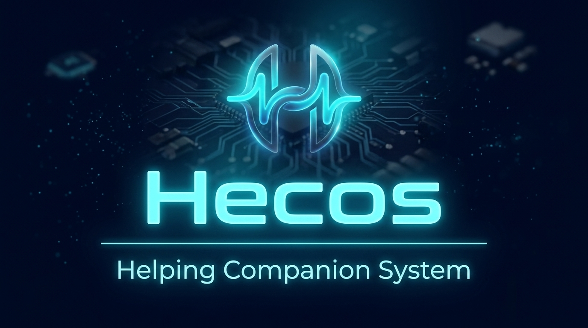

# 🌌 Progetto Hecos
<p align="center">
  
</p>

# Hecos - Versione 0.19.1 (Runtime Alpha)
Lingua: [English](README.md) | [Italiano](README_ITA.md) | [Español](README_ESP.md)

# 🤖 Hecos
**Helping Companion System (Privato, Veloce, Semplice)**

---

> **Stato Runtime Alpha**: Hecos è attualmente in `v0.19.1`. Questo è un Helping Companion System locale che funge da ponte tra il ragionamento ad alto livello e l'esecuzione di sistema root.

## 🚀 Panoramica
**Hecos** è un **Helping Companion System**: un ecosistema locale che unisce AI reasoning, controllo di sistema root e networking avanzato. Trasforma l'hardware locale in un'entità digitale sovrana attraverso una dashboard professionale e un'infrastruttura di sicurezza avanzata.

Costruito su tre pilastri fondamentali:
* 🛡️ **Privacy al Primo Posto** — Funzionamento 100% locale, zero dipendenze cloud e architettura privacy a 3 livelli.
* ⚡ **Velocità Estrema** — Architettura nativa ottimizzata e sistema di plugin ad alte prestazioni per una reattività istantanea.
* 🧊 **Semplicità Assoluta** — Dashboard professionale e design modulare che rende intuitiva l'orchestrazione IA avanzata.

Ora completamente migrato a una **architettura stabile a Runtime Alpha**, Hecos 0.19.1 offre una interfaccia Web dedicata (Chat + Config) e internazionalizzazione completa. Grazie a **LiteLLM**, supporta Ollama, KoboldCpp e i principali provider cloud con streaming in tempo reale e TTS locale.

---

## ✨ Caratteristiche Principali (v0.19.1)
* 🎨 **Flux Prompt Studio** — Prompt engineering in tempo reale per Flux.1 con persistenza automatica dei metadati sidecar.
* 🖼️ **Image Metadata Injection** — I risultati dell'IA generativa ora includono sidecar JSON nascosti (.txt) contenenti prompt, seed e info sul sampler per workflow professionali.
* 🎭 **Chat UI Potenziata** — Nuovi header della chat con nomi Utente/Persona visibili, timestamp e posizionamento migliorato delle azioni messaggio (Copia/Modifica/Rigenera).
* 🔄 **Rigenerazione Corretta** — Risolti i problemi critici di duplicazione della cronologia e mismatch della sessione durante la rigenerazione dei messaggi.
* 🛡️ **Architettura Privacy a 3 Livelli** — Gestione unificata delle sessioni con modalità **Normale**, **Auto-Wipe** (memoria RAM) e **Incognito** (traccia zero).
* 🔌 **Universal Tool Hub (MCP Bridge)** — Supporto nativo per il **Model Context Protocol**. Collegati a migliaia di tool AI esterni con un solo click.
* 🔭 **Deep MCP Discovery** — Explorer avanzato con ricerca multi-registry (Smithery, MCPSkills, GitHub) e installazione immediata.
* 🔒 **Hecos PKI Professionale (HTTPS)** — Certificazione Root CA integrata per abilitare Mic/Camera su tutta la LAN in sicurezza.
* 🏗️ **Plugin WebUI Nativo** — Interfaccia ad alte prestazioni ottimizzata per desktop e dispositivi mobile.
* 🗂️ **Hecos Drive (File Manager)** — Gestione file e editor integrato con interfaccia a doppio pannello.

---

## 🧠 Come Funziona
Hecos è costruito attorno a un'architettura modulare:
* **Core** → Instradamento AI, elaborazione, esecuzione.
* **Plugins** → Azioni e capacità (sistema, web, media, ecc.).
* **Memory** → Identità e archiviazione persistente.
* **UI** → Livello di interazione con l'utente.
* **Bridge** → Integrazioni esterne e API.

L'AI genera comandi strutturati che vengono interpretati ed eseguiti attraverso il sistema di plugin.

---

## ⚡ Avvio Rapido (Installazione One-Click)
Il modo più semplice per installare e configurare Hecos da zero è utilizzare il **Wizard di Setup Universale**.

### 1. Clona il repository
```bash
git clone https://github.com/Hecos-Project/Hecos.git
cd Hecos
```

### 2. Lancia il Setup Wizard
Esegui lo script di bootstrap per la tua piattaforma. Questo controllerà automaticamente Python, installerà le dipendenze e avvierà il wizard di configurazione nel tuo browser.

**Windows:**
```powershell
.\START_SETUP_HERE_WIN.bat
```

**Linux:**
```bash
bash START_SETUP_HERE_LINUX.sh
```

### 3. Componenti Manuali e Script di Utilità
Se preferisci gestire i componenti singolarmente o eseguire manutenzione manuale, usa questi script dedicati:

| Piattaforma | Script | Descrizione |
| :--- | :--- | :--- |
| **Tutte** | `main.py` | Avvia il sistema completo (Tray + WebUI + Backend) |
| **Windows** | `RESTART_TRAY_ICON_WIN.bat` | Ripristina l'icona tray se è stata chiusa |
| **Linux** | `RESTART_TRAY_ICON_LINUX.sh` | Ripristina l'icona tray se è stata chiusa |
| **Windows** | `scripts\windows\run\HECOS_WEB_RUN_WIN.bat` | Avvia SOLO l'interfaccia Web e il Server |
| **Linux** | `scripts/linux/run/hecos_web_run.sh` | Avvia SOLO l'interfaccia Web e il Server |
| **Windows** | `scripts\windows\run\HECOS_CONSOLE_RUN_WIN.bat` | Avvia SOLO la Console Terminale (TUI) |
| **Linux** | `scripts/linux/run/HECOS_CONSOLE_RUN.sh` | Avvia SOLO la Console Terminale (TUI) |
| **Windows** | `scripts\windows\setup\INSTALL_HECOS_WIN.bat` | Installazione manuale dipendenze e Piper |
| **Linux** | `scripts/linux/setup/INSTALL_HECOS_LINUX.sh` | Installazione manuale dipendenze e Piper |

### 4. Configurazione e Primo Avvio

### 🛡️ Modalità Stealth (Senza Finestre)
Se desideri che Hecos giri completamente in background senza alcuna finestra di terminale visibile:
1.  **Usa l'Icona Tray**: Avvia Hecos tramite l'icona nella barra di sistema. Gestirà i componenti di sistema in modo invisibile in background.
3.  **Avvio Silenzioso**: Usa `START_HECOS_SILENT_WIN.vbs` per un avvio al 100% invisibile (senza finestre di console).
3.  **Recupero Manuale**: Se chiudi l'icona per errore, usa `START_HECOS_TRAY_WIN.bat`.

---

## 🧠 Backend AI Supportati (Motori LLM)

Hecos è completamente offline di default e richiede un motore AI locale per elaborare logica e conversazione. Durante il setup iniziale, devi installare uno dei backend indipendenti qui sotto. Hecos li rileverà automaticamente.

### 🔹 1. Ollama (Consigliato)
Facile da usare, veloce e ottimizzato. Funge da servizio in background.
- **Download**: 👉 https://ollama.com/download
- **Setup**: Una volta installato, apri il tuo terminale/prompt dei comandi ed esegui `ollama run llama3.2` per scaricare e testare un modello leggero e veloce. Hecos lo rileverà istantaneamente.

### 🔹 2. KoboldCpp (Alternativa)
Perfetto per modelli manuali GGUF e hardware più datato senza pesanti installazioni.
- **Download**: 👉 https://github.com/LostRuins/koboldcpp/releases
- **Setup**: Scarica il file `.exe` (o il binario Linux), fai doppio clic, seleziona qualsiasi modello GGUF scaricato da HuggingFace e avvialo. Hecos si connetterà automaticamente tramite la porta `5001`.

---

## 🔌 Sistema di Plugin
Hecos utilizza un'architettura dinamica. Ogni plugin può registrare comandi, eseguire azioni di sistema ed estendere le capacità dell'AI.

Plugin inclusi:
* **Controllo di sistema e Gestione file**
* **Automazione Web e Dashboard hardware**
* **Controllo media e Cambio modello**
* **Gestione della memoria**

---

## 💾 Sistemi di Memoria e Voce

### 🗄️ Systema di Memoria
Hecos include un livello di memoria persistente gestito da SQLite per un'archiviazione locale leggera. Memorizza le conversazioni, mantiene l'identità e salva le preferenze dell'utente.

### 🎙️ Sistema Vocale
* **Input Speech-to-text** (da voce a testo)
* **Output Text-to-speech** (da testo a voce)
* **Interazione in tempo reale**

---

## 🔗 Integrazioni e Privacy

### 🤝 Integrazioni
Hecos può integrarsi con:
* **Open WebUI** (chat + streaming)
* **Home Assistant** (tramite bridge)

### 🔐 Privacy al Primo Posto
Hecos è progettato pensando alla privacy: funziona al 100% localmente, nessun servizio cloud obbligatorio e pieno controllo sui propri dati.

---

## 🛣️ Tabella di Marcia (Roadmap)
- [ ] 📱 Integrazione Telegram (controllo remoto)
- [ ] 🧠 Sistema di memoria avanzato
- [ ] 🤖 Architettura multi-agente
- [ ] 🛒 Marketplace dei plugin
- [ ] 🎨 UI/UX migliorata

---

## ⚠️ Esclusione di Responsabilità (Disclaimer)
Hecos può eseguire comandi a livello di sistema e controllare il tuo ambiente. Usalo responsabilmente. L'autore non è responsabile per usi impropri o danni.

---

## 📜 Licenza
Licenza GPL-3.0

---

## 👥 Crediti e Contatti
Sviluppatore Capo: Antonio Meloni (Tony)
Email Ufficiale: hecos.project@gmail.com

---

## 📚 Documentazione
- 📖 **[Guida Unificata (ITA)](docs/GUIDA_UNIFICATA_ITA.md)**: Tutto ciò che devi sapere sulla v0.19.1.
- 🏗️ **[Guida all'Architettura](docs/TECHNICAL_GUIDE.md)**

- 🔌 **[Sviluppo Plugin](docs/PLUGINS_DEV.md)**
- 📁 **[Mappa Struttura](docs/ARCHITECTURE_MAP.md)**

---

## 💡 Visione
Hecos mira a diventare una piattaforma di assistenza AI locale completamente autonoma: un'alternativa privata ed estensibile ai sistemi AI basati su cloud.