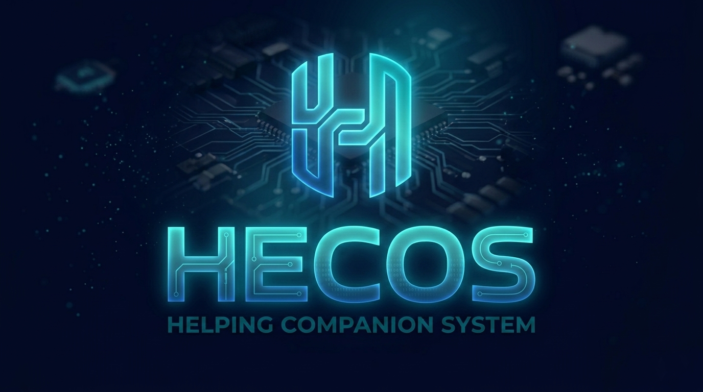

# 🌌 Progetto Hecos
<p align="center">
  
</p>

# Hecos - Versione 0.50.0 (Fase II: Ghost Fire)
Lingua: [English](README.md) | [Italiano](README_ITA.md) | [Español](README_ESP.md)

# 🤖 Hecos
**Helping Companion System (Privato, Rapido, Semplice)**

---

> **Stato: Fase II (Ghost Fire)**: Hecos è attualmente in `v0.50.0`. Questo è un Helping Companion System che funge da ponte tra il ragionamento ad alto livello e l'esecuzione di sistema root.
>
> ⚠️ **Avviso Importante**: A partire da questa major release (0.50.0+), lo sviluppo primario e l'ambiente target migrano ufficialmente a **Windows 11**.

## 🚀 Panoramica
**Hecos** è un **Helping Companion System**: un ecosistema locale progettato per unire fluidamente tecnologia e vita umana, combinando AI reasoning, automazione visiva ed esecuzione di sistema diretta. Invece di inseguire concetti astratti come la sovranità digitale, Hecos si concentra su un'unica missione pragmatica: **migliorare la vita umana**, trasformando l'hardware locale in uno strumento pratico ed estremamente efficiente per tutti i giorni.

Costruito su tre pilastri fondamentali:
* 🛡️ **Privacy al Primo Posto** — Funzionamento 100% locale, zero dipendenze cloud e architettura privacy a 3 livelli.
* ⚡ **Velocità Estrema** — Architettura nativa ottimizzata e sistema di plugin ad alte prestazioni per una reattività istantanea.
* 🧊 **Semplicità Assoluta** — Dashboard professionale e design modulare che rende intuitiva l'orchestrazione IA avanzata.

Ora completamente migrato a una **architettura stabile Fase II: Ghost Fire**, Hecos 0.50.0 offre una interfaccia Web dedicata (Chat + Config) e internazionalizzazione completa. Grazie a **LiteLLM**, supporta Ollama, Llama.cpp, KoboldCpp e i principali provider cloud con streaming in tempo reale e TTS locale (Kokoro e Piper).

---

## ✨ Caratteristiche Principali (v0.50.0)
* 🎭 **Override Chat in Linea e Personalità Infinite** — Sovrascrivi il modello AI, la Persona e la Voce direttamente nell'interfaccia della chat al volo. Crea personalità infinite all'istante per ogni singola sessione di conversazione.
* 📦 **Architettura HPM 0.40** — Migrazione completa a configurazioni Pydantic+TOML, introducendo vincoli di versione per le dipendenze e `pip_requirements` bloccati.
* 🛠️ **External Dependency Manager (EDM)** — Nuovo sistema che rileva automaticamente le dipendenze principali mancanti (Node, Tesseract, VC++), consentendo download con un clic direttamente dalla WebUI.
* 🛡️ **HPM Integrity Verification** — Nuova API `/verify` e UI della Control Room per convalidare crittograficamente i file dei pacchetti installati rispetto ai loro hash manifest firmati Ed25519.
* 🔒 **Hecos SDK (Isolamento Totale)** — Esegui i pacchetti HPM in processi isolati dedicati e ambienti virtuali indipendenti (venv) per evitare conflitti di dipendenze e blocchi del thread principale.
* ⚡ **HDCS (Comandi Diretti)** — Esegui istantaneamente oltre 150 funzioni native saltando il "cervello" dell'IA digitando `/` nella chat o con `Ctrl+Alt+Spazio` ovunque.
* ⚙️ **Motore di Automazione Flows** — Editor visuale a nodi (drag-and-drop) per la creazione di automazioni complesse multi-step, trigger e azioni con integrazione NLP vocale.
* **📅 Calendario Integrato** — Modulo calendario completo con tracciamento delle festività e codifica a colori localizzata per gli eventi.
* **⏰ Modulo Promemoria** — Pianificatore di attività basato su NLP con funzionalità di snooze e notifiche OS attive.
* **💻 Finestra Azioni (Action Window)** — Console pulita in stile terminale direttamente all'interno della UI della chat, per monitorare l'esecuzione nativa del sistema e i processi in background.
* **🎵 Nuovo Media Player** — Backend audio avanzato (VLC 64-bit + fallback FFplay) che supporta uno stato di ripresa/pausa resiliente, calcoli dinamici delle playlist e controllo del volume globale.
* 🎨 **Flux Prompt Studio** — Prompt engineering in tempo reale per Flux.1 con persistenza automatica dei metadati sidecar.
* 🖼️ **Image Metadata Injection** — I risultati dell'IA generativa ora includono sidecar JSON nascosti (.txt) contenenti prompt, seed e info sul sampler per workflow professionali.
* 🎭 **Chat UI Potenziata** — Nuovi header della chat con nomi Utente/Persona visibili, timestamp e posizionamento migliorato delle azioni messaggio (Copia/Modifica/Rigenera).
* 🔄 **Rigenerazione Corretta** — Risolti i problemi critici di duplicazione della cronologia e mismatch della sessione durante la rigenerazione dei messaggi.
* 🗃️ **Archivio Chat Dual-Mode** — Sistema di archiviazione contestuale con ripristino di singole chat e funzionalità di cancellazione di massa.
* 🧠 **RAG ad Alte Prestazioni (FastEmbed)** — Memoria vettoriale multi-tenant nativa per CPU, con ONNX e LanceDB per un'ingestione istantanea dei documenti.
* 🔐 **Isolamento Vault per Utente** — Architettura di memoria consolidata che garantisce l'assoluta separazione della privacy per i dati semantici e la cronologia per ciascun profilo.
* 🛡️ **Architettura Privacy a 3 Livelli** — Gestione sessioni unificata con le modalità **Normale**, **Auto-Wipe** (RAM-only, cancellazione all'uscita) e **Incognito** (modalità fantasma).
* 📦 **Hecos Package Manager (HPM)** — Il tassello definitivo per l'estensibilità universale. Un installatore centralizzato e dinamico che supporta pacchetti standalone `.hpkg`. Installa facilmente plugin di terze parti, widget e pannelli di configurazione con drag-and-drop, configurazioni isolate e firme digitali Ed25519.
* 🔌 **Universal Tool Hub (MCP Bridge)** — Supporto nativo per il **Model Context Protocol**. Collegati a migliaia di tool AI esterni con un solo click.
* 🔭 **Deep MCP Discovery** — Explorer avanzato con ricerca multi-registry (Smithery, MCPSkills, GitHub) e installazione immediata.
* 🔒 **Hecos PKI Professionale (HTTPS)** — Certificazione Root CA self-signed integrata per un'esperienza "Green Lock" (lucchetto verde) di sicurezza su tutti i dispositivi della LAN.
* 🏗️ **Plugin WebUI Nativo** — Interfaccia ad alte prestazioni ottimizzata per desktop e dispositivi mobile.
* 🎛️ **Control Room e Widget** — Una dashboard personalizzabile in stile masonry per i widget in tempo reale e la telemetria dell'OS.
* 🌐 **Browser Automation** — Plugin nativo per l'interazione semantica web e lo scraping.
* ⌨️ **OS Automation** — Plugin nativo per il controllo programmatico di mouse e tastiera.
* 💾 **Hecos Drive (File Manager)** — Gestione file e editor integrato con interfaccia a doppio pannello.

---

## 🧠 Come Funziona
Hecos è costruito attorno a una struttura altamente modulare a 8 livelli. Tutto è un **modulo**:
* **Core Modules** → Funzioni di sistema e OS integrate non rimovibili.
* **Plugins** → Strumenti reattivi e capacità chiamate dall'IA (sistema, web, media, ecc.).
* **Apps** → Mini-applicazioni autonome con UI e ciclo di vita indipendenti.
* **Personas** → Profili comportamentali e personalità IA installabili.
* **Widgets** → Componenti frontend interattivi per la dashboard della Control Room.
* **Themes** → Pacchetti CSS personalizzati per lo stile dell'interfaccia.
* **Skill Packs** → Pacchetti aggiuntivi di comandi slash (`/`) per la chat.
* **MCP Servers** → Bridge universali per tool esterni tramite il Model Context Protocol.

L'AI genera comandi strutturati che vengono interpretati ed eseguiti attraverso il sistema di plugin.

---

### 🎭 L'Anima della Macchina: Persona Native

Una capacità fondamentale di Hecos è il cambio nativo della Personalità (**Personality Switching**). Hecos non è un assistente freddo e rigido: adatta il suo comportamento, il tono e il carattere in base alla persona caricata. Ogni personalità è programmata per agire in modo diverso e ricoprire un ruolo unico nella tua vita quotidiana.

<p align="center">
  
  <br>
  <em>Urania 9800, la mascotte ufficiale di Hecos e la tua amica fidata di tutti i giorni.</em>
</p>

Pronte all'uso, Hecos include diverse personalità preconfigurate:
* **Hecos System Soul** — Il sistema centrale neutro, rigido e distaccato. Perfetto per l'automazione pura e compiti di precisione.
* **Urania 9800** — La mascotte vivace. Una vera amica di tutti i giorni, progettata per interazioni empatiche, allegre e informali.
* **Sebastian Pro** — Il maggiordomo perfetto e altamente professionale. Educato, efficiente e pronto a servire.
* **Atlas** — L'imponente e autorevole custode digitale.
* **Nova X-01** — Un'entità robotica precisa e analitica per chi preferisce interazioni puramente logiche.

Puoi scambiare al volo queste personalità in qualsiasi momento, cambiando non solo la voce e il tono, ma l'anima stessa del sistema.

---

## ⚡ Avvio Rapido (Installazione One-Click)
Il modo più semplice per installare e configurare Hecos da zero è utilizzare il **Wizard di Setup Universale**.

### 1. Clona il repository
```bash
git clone [https://github.com/Hecos-Project/Hecos.git](https://github.com/Hecos-Project/Hecos.git)
cd Hecos
```

### 2. Lancia il Setup Wizard
Esegui lo script di bootstrap per la tua piattaforma. Questo controllerà automaticamente Python, installerà le dipendenze e avvierà il wizard di configurazione nel tuo browser.

**Windows:**
```powershell
.\START_SETUP_HERE_WIN.bat
```

**Linux:**
```bash
bash START_SETUP_HERE_LINUX.sh
```

### 3. Componenti Manuali e Script di Utilità
Se preferisci gestire i componenti singolarmente o eseguire manutenzione manuale, usa questi script dedicati:

| Piattaforma | Script | Descrizione |
| :--- | :--- | :--- |
| **Tutte** | `main.py` | Avvia il sistema completo (Tray + WebUI + Backend) |
| **Windows** | `RESTART_TRAY_ICON_WIN.bat` | Ripristina l'icona tray se è stata chiusa |
| **Linux** | `RESTART_TRAY_ICON_LINUX.sh` | Ripristina l'icona tray se è stata chiusa |
| **Windows** | `scripts\windows\run\HECOS_WEB_RUN_WIN.bat` | Avvia SOLO l'interfaccia Web e il Server |
| **Linux** | `scripts/linux/run/hecos_web_run.sh` | Avvia SOLO l'interfaccia Web e il Server |
| **Windows** | `scripts\windows\run\HECOS_CONSOLE_RUN_WIN.bat` | Avvia SOLO la Console Terminale (TUI) |
| **Linux** | `scripts/linux/run/HECOS_CONSOLE_RUN.sh` | Avvia SOLO la Console Terminale (TUI) |
| **Windows** | `scripts\windows\setup\INSTALL_HECOS_WIN.bat` | Installazione manuale dipendenze e Piper |
| **Linux** | `scripts/linux/setup/INSTALL_HECOS_LINUX.sh` | Installazione manuale dipendenze e Piper |

### 4. Configurazione e Primo Avvio
Hecos è progettato per un'esperienza professionale "scarica e gioca".
- Al primo avvio, il sistema rileverà l'assenza di `system.yaml` e `routing_overrides.yaml`.
- **Genererà automaticamente** questi file copiando i modelli da `hecos/config/data/*.example`.
- Troverai la tua configurazione personale in `hecos/config/data/system.yaml` (impostazioni principali) e `routing_overrides.yaml` (regole di instradamento AI).
- **Consiglio da esperto**: Usa il [Routing Editor] integrato nella WebUI per modificare in sicurezza queste regole senza toccare il codice.

### 🔐 Login & Autenticazione
Hecos richiede l'autenticazione obbligatoria. Il login predefinito al primo avvio è:
- **Username:** `admin`
- **Password:** `hecos`

Consigliamo caldamente di modificare la password immediatamente dal pannello **Utenti** all'interno delle impostazioni di configurazione.

**Ripristino Password:**
Se rimani chiuso fuori, esegui `python scripts/reset_admin.py` dal terminale per forzare una nuova password, oppure elimina manualmente il file `memory/users.db` per ripristinare i valori predefiniti di sistema.

### 🛡️ Modalità Stealth (Senza Finestre)
Se desideri che Hecos giri completamente in background senza alcuna finestra di terminale visibile:
1. **Usa l'Icona Tray**: Avvia Hecos tramite l'icona nella barra di sistema. Gestirà i componenti di sistema in modo invisibile in background.
2. **Avvio Silenzioso**: Usa `START_HECOS_SILENT_WIN.vbs` per un avvio al 100% invisibile (senza finestre di console).
3. **Recupero Manuale**: Se chiudi l'icona per errore, usa `START_HECOS_TRAY_WIN.bat`.

---

## 💻 Compatibilità di Piattaforma e Sistemi Operativi

Nonostante molti pacchetti di estensione dell'ecosistema Hecos (come **Browser Automation**, **Messenger**, **Calendar**, **Weather Pro**, **Mail**, **Image Gen**, **Reminder**, **Lists**, **Maps** e **Quick Links**) siano totalmente multipiattaforma e progettati per funzionare su Linux e macOS, **il sistema core di Hecos, al momento, è stato testato unicamente su Windows 10 e 11**.

Eseguire il sistema core su Linux o macOS è possibile, ma potrebbe richiedere aggiustamenti manuali, e alcune funzionalità native avanzate (come l'ispezione della UI nel pacchetto PC Automation) sono progettate specificamente per Windows.

---

## 🛠️ Requisiti di Sistema Essenziali (Windows)
Se hai appena reinstallato Windows o stai configurando Hecos per la prima volta, devi assicurarti che questi pacchetti di sistema **fondamentali** siano presenti affinché tutti i moduli funzionino correttamente.

💡 **NOVITÀ (v0.45.0 - EDM)**: Hecos ora integra l'**External Dependency Manager (EDM)**! Se Tesseract, Node.js o VC++ Redistributable non sono installati, l'EDM li rileverà automaticamente e ti permetterà di scaricarli in background tramite un click dalla WebUI attingendo direttamente dal repository GitHub `Hecos-Dependencies`. In alternativa, puoi installarli manualmente:

1. ⚙️ **Microsoft Visual C++ Redistributable (Obbligatorio)**
   - *A cosa serve*: Richiesto dal motore di Memoria RAG (ONNX/FastEmbed). Senza questo pacchetto riceverai errori relativi a DLL mancanti e la ricerca sui documenti non funzionerà.
   - *Download*: 👉 [Scarica VC++ Redist x64](https://aka.ms/vs/17/release/vc_redist.x64.exe)

2. 🎵 **VLC Media Player 64-bit (Obbligatorio)**
   - *A cosa serve*: Il motore Audio e il Media Player integrato di Hecos utilizzano le librerie di VLC in background per riprodurre musica, allarmi e l'output vocale TTS.
   - *Download*: 👉 [Scarica VLC 64-bit](https://www.videolan.org/vlc/download-windows.html)

3. 👁️ **Tesseract OCR (Consigliato per la Visione)**
   - *A cosa serve*: Necessario per le capacità visive avanzate e per leggere il testo sullo schermo tramite OCR (`pytesseract`). 
   - *Download*: 👉 [Scarica Tesseract OCR per Windows](https://github.com/UB-Mannheim/tesseract/wiki)

4. 🟢 **Node.js (Consigliato / Richiesto per lo sviluppo e build del Canvas)**
   - *A cosa serve*: Necessario per compilare, buildare e gestire le dipendenze del modulo dell'Editor Visuale dei Flussi (ReactFlow/Vite). Se hai bisogno di compilare il frontend del canvas (`npm run build`), Node.js è richiesto.
   - *Download*: 👉 [Scarica Node.js LTS](https://nodejs.org/)

---

### 📦 Installazione Offline (Cartella `dependencies`)
Per tua comodità, tutti i pacchetti di installazione necessari sono inclusi offline direttamente all'interno della cartella `dependencies/` alla radice del progetto:
* `dependencies/VC_redist.x64.exe` -> Microsoft Visual C++ Redistributable (ONNX/RAG)
* `dependencies/node-v24.16.0-x64.msi` -> Node.js LTS (Canvas / Frontend Build)
* `dependencies/tesseract-ocr-w64-setup-5.5.0.20241111.exe` -> Tesseract OCR (Visione)

*Nota: Consigliamo caldamente di installare questi componenti prima di avviare il setup automatico di Hecos.*

---

## 🧠 Backend AI Supportati (Motori LLM)

Hecos è completamente offline di default e richiede un motore AI locale per elaborare logica e conversazione. Durante il setup iniziale, devi installare uno dei backend indipendenti qui sotto. Hecos li rileverà automaticamente.

### 🔹 1. Ollama (Consigliato)
Facile da usare, veloce e ottimizzato. Funge da servizio in background.
- **Download**: 👉 https://ollama.com/download
- **Setup**: Una volta installato, apri il tuo terminale/prompt dei comandi ed esegui `ollama run llama3.2` per scaricare e testare un modello leggero e veloce. Hecos lo rileverà istantaneamente.

### 🔹 2. Llama.cpp (Alternativa)
Lo standard di riferimento per eseguire modelli locali grezzi con massima efficienza e personalizzazione.
- **Setup**: Avvia il tuo server `llama.cpp` sulla porta predefinita. Hecos è pienamente compatibile e reindirizzerà le richieste tramite il suo proxy interno.

### 🔹 3. KoboldCpp (Alternativa)
Perfetto per modelli manuali GGUF e hardware più datato senza pesanti installazioni.
- **Download**: 👉 https://github.com/LostRuins/koboldcpp/releases
- **Setup**: Scarica il file `.exe` (o il binario Linux), fai doppio clic, seleziona qualsiasi modello GGUF scaricato da HuggingFace e avvialo. Hecos si connetterà automaticamente tramite la porta `5001`.

---

## 🔌 Sistema di Plugin
Hecos utilizza un'architettura dinamica. Ogni plugin può registrare comandi, eseguire azioni di sistema ed estendere le capacità dell'AI.

Plugin inclusi:
* **Controllo di sistema e Gestione file**
* **Automazione Web e Dashboard hardware**
* **Controllo media e Cambio modello**
* **Gestione della memoria**

Puoi installare nuovi pacchetti dinamicamente trascinando i file `.hpkg` nel **Package Manager** all'interno della WebUI. Questi pacchetti standalone contengono la propria logica, pannelli UI e schemi di configurazione. Tutti i pacchetti sono verificati tramite firme digitali Ed25519 per la massima sicurezza.

---

## 💾 Sistemi di Memoria e Voce

### 🗄️ Sistema di Memoria
Hecos includes un livello di memoria persistente gestito da SQLite per un'archiviazione locale leggera. Memorizza le conversazioni, mantiene l'identità e salva le preferenze dell'utente.

### 🎙️ Sistema Vocale
* **Input Speech-to-text** (da voce a testo)
* **Output Text-to-speech Avanzato** (Dotato sia di Kokoro TTS che di Piper TTS per generare voci locali naturali e ad alta fedeltà)
* **Interazione in tempo reale**

---

## 🔗 Integrazioni e Privacy

### 🤝 Integrazioni
Hecos può integrarsi con:
* **Open WebUI** (chat + streaming)
* **Home Assistant** (tramite bridge)

### 🔐 Privacy al Primo Posto
Hecos è progettato con un focus rigoroso su utilità e discrezione: funziona al 100% localmente, nessun servizio cloud obbligatorio e pieno controllo sui propri dati.

---

## 🛣️ Tabella di Marcia (Roadmap)
- [ ] 📱 Integrazione Telegram (controllo remoto)
- [ ] 🧠 Sistema di memoria avanzato
- [ ] 🤖 Architettura multi-agente
- [ ] 🛒 Marketplace dei plugin
- [ ] 🎨 UI/UX migliorata

---

## ⚠️ Esclusione di Responsabilità (Disclaimer)
Hecos può eseguire comandi a livello di sistema e controllare il tuo ambiente. Usalo responsabilmente. L'autore non è responsabile per usi impropri o danni.

---

## 📜 Licenza
Licenza GPL-3.0

---

## 👥 Crediti e Contatti
Sviluppatore Capo: Antonio Meloni (Tony)
Email Ufficiale: hecos.project@gmail.com

---

## 📚 Documentazione
Hecos utilizza un sistema di documentazione modulare localizzato in EN, IT e ES.

### Accesso Locale (Modulare)
Le guide dettagliate si trovano nella cartella `docs/`:
- 📖 **[Guida Unificata (ITA)](docs/GUIDA_UNIFICATA_ITA.md)**: Tutto ciò che devi sapere sulla v0.44.0.
- 🏗️ **[Guida Tecnica](docs/tech/)**: (Admin/Dev) Dettagli sull'architettura di sistema e OOP.

### Accesso Online
La documentazione è inoltre sincronizzata con la **[GitHub Wiki](https://github.com/Hecos-Project/Hecos/wiki)**.

---

## 💡 Visione
Hecos mira a diventare una piattaforma di assistenza AI locale completamente autonoma: un'alternativa privata ed estensibile ai sistemi AI basati su cloud, focalizzata esclusivamente sul servire e migliorare la vita umana.